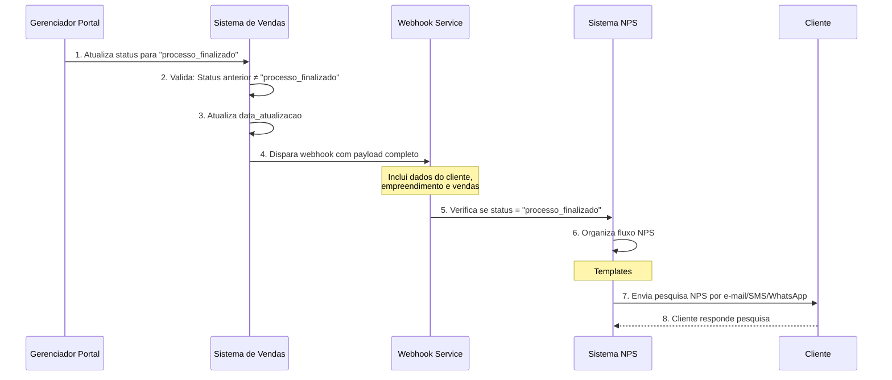

# NPS quadraimob

## **Visão Geral**
Este caso de uso descreve a integração do portal de vendas com o sistema de NPS da quadraimob.



## **Atores**
| Ator | Descrição | Responsabilidade |
|------|-----------|------------------|
| **Gerenciador do Portal de Vendas** | Secretaria/Administrador do sistema | Gerenciar os status da venda imobiliária |
| **Sistema de Webhook** | Serviço de eventos | Disparar payload para endpoints configurados |
| **Sistema de NPS** | Sistema de Net Promoter Score | Gerenciar envio de pesquisas de satisfação |
| **Cliente/Comprador** | Adquirente do imóvel | Receber e responder à pesquisa NPS |


### **Disparo do Webhook**
**Endpoint do Webhook:** `POST {host}/webhook`

**Headers:**
```http
Content-Type: application/json
X-API-Key: API_KEY
```

**Payload Completo:**
```json
{
    "id_venda": 6010,
    "status": "processo_finalizado",
    "data_criacao": "2026-02-03T10:30:00Z",
    "data_atualizacao": "2026-02-03T12:45:00Z",
    "dados_empreendimento": {
        "nome": "UNION 511",
        "endereco": "CRNW 511 - BLOCO A LOTE 01 - NOROESTE",
        "unidade": "1234",
        "bloco": "Bloco B",
        "vagas": ["157R"]        
    },
    "dados_cliente": {
        "nome": "HERMINIO DE SOUSA JUNIOR",
        "sexo": "MASCULINO",
        "data_de_nascimento": "1985-08-20",
        "email": "HERMSOU3SA@TESTE.COM ",
        "telefone": "61 9 9999-9999",
        "estado_civil": "CASADO(A)",
        "conjuge": {
            "nome": "MONICA CRISTINA ALTAF JULIEN DE SOUSA",
            "sexo": "FEMININO",
            "data_de_nascimento": "1985-08-20",
            "email": "MCJ3ULIEN@TESTE.COM",
            "telefone": "61 9 9999-9999"
        }
    }
}
```

## **Exemplo de Resposta do Webhook**
```json
{
  "status": "received",
  "mensagem": "Webhook processado com sucesso",
  "event_id": "evt_20260203_6010",
  "processado_em": "2026-02-03T12:45:05.123Z"
}
```

